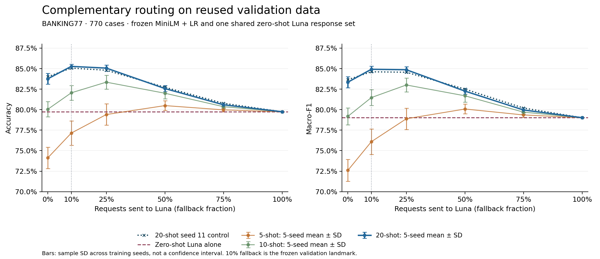

# Data-Efficient Specialist Inference

An **Intelligent Dynamics** project studying complementary intent classifiers under a limited training-label budget.

**Can confidence-based routing combine a few-shot specialist with a complementary LLM to improve classification quality while reducing LLM calls, and what local inference overhead does this introduce?**



These are **reused-validation results**, not final-test estimates. Across the five existing 20-shot models, specialist-only accuracy is **83.77%**, zero-shot Luna accuracy is **79.74%**, and the hybrid at 90% specialist coverage achieves **85.27%**. On each seed's matching 77 rejected requests, specialist accuracy averages **45.19%**, versus **60.26%** for Luna. The resulting hybrid gain over specialist-only is **1.51 percentage points**. Luna is a complementary classifier here; it is not established as stronger overall on this task. [Independent replay, all seed counts and negative results](experiments/v1-complementary-validation/README.md).

The chart reports classification quality against the fraction sent to Luna, with training-seed sample SD. Five seeds share the same 770 validation requests and Luna predictions; seed SD is not a confidence interval over future traffic. Fewer API requests do not establish total-system savings. Each 20-shot specialist uses **1,540 fitting labels plus 770 reused validation labels**, with external MiniLM pretraining.

## Bounded v1 status

- Completed: TF-IDF/MiniLM validation learning curves, confidence diagnostics and recovered zero-shot Luna validation comparison; previous artifacts and negative results are preserved.
- Local CPU measurement: the existing frozen seed-11 specialist is benchmarked as one deployed model, with **5.91 ms median / 7.82 ms p95** warm request latency, **370.18 requests/s** at batch 32 and **582.92 MiB** lifetime process peak RSS on this Apple M1 Pro. Loading and inference are separate; no deployment price is assumed. See [EXP-008](experiments/exp008-cpu-validation/README.md).
- Retrieved-example comparison: [EXP-009](experiments/exp009-retrieved-luna/README.md) adds exactly 20 retrieved demonstrations from the same seed-11 training pool. Implementation and offline requests are prepared; no paid pilot or retrieved-Luna quality result exists.
- Final-test performance remains **unmeasured**. The user reports that an earlier authorized preflight mechanically opened the official test. No test predictions or scores have been produced; this pass performs no further access. EXP-007's original protocol remains unchanged, and proceeding immediately to its live run is superseded by this bounded v1 scope.

A compatibility assertion in the original runner currently rejects inert empty encoder prompts; its minimal fix needs review before final launch. The new CPU helper validates empty prompts without changing model behavior. All paid collection requires new, experiment-specific approval and a numeric cap. Historical prices and conditional estimates grant no spending permission. See [current plan](docs/CURRENT_PLAN.md) for the next bounded step.

## Historical reproduction commands

Use Python 3.13.0 and [uv](https://docs.astral.sh/uv/). The canonical checkout is `/Users/Andrew/Developer/data-efficient-inference`; run commands from that repository root. `uv.lock` pins all resolved dependencies; the first sync and uncached dataset preparation need network access.

```sh
cd /Users/Andrew/Developer/data-efficient-inference
uv sync --locked --cache-dir .cache/uv
.venv/bin/python -m pytest -q
.venv/bin/python -m baseline prepare
.venv/bin/python -m baseline run --shots 5 --seed 11 --output artifacts/exp001-v2-n5-s11
```

Choose a new output directory for each run; existing runs are never overwritten. Preparation is idempotent, checks file hashes, and refuses to overwrite a changed split manifest. Once files are cached, preparation and training work offline.

The source is fixed to publisher revision `57ec275d8078af65b7731c2a98be812d844a6d6b`, with SHA-256 checksums in [the source manifest](data/banking77-source.json). Preparation audits exact/normalized duplicates, leaves official test rows untouched, and stores only test IDs and text hashes in the split manifest. Training loads only training-source texts and verifies test-file byte integrity. The guarded final-test CLI is separate and requires explicit authorization; do not use these historical preparation/training commands in this bounded pass.

Protocol `banking77-val10-v2` reserves **10 examples per class** (770 total), fixed with seed `20260924` and shared across every regime and sampling seed. Training seeds `11`, `22`, `33`, `44`, `55` define nested **5-, 10-, and 20-shot** subsets. All three regimes are feasible across all 77 classes: the smallest class has 35 usable source rows and retains 25. **50-shot is dropped**, since supporting it would require excluded classes, repeated examples, or new data. No official test examples enter development.

The default manifest is `data/processed/banking77-val10-v2/manifest.json`. The legacy validation=20 manifest and smoke artifacts are preserved; current code rejects that old manifest. Earlier smoke scores must not be pooled with new-protocol results. The 770-example holdout supports coarse early model comparisons, but not precise per-class estimates or trustworthy high-confidence calibration claims. See [the current plan](docs/CURRENT_PLAN.md) for the limitations and future calibration requirements.

Each run saves `metadata.json`, `metrics.json`, `samples.json`, `split_manifest.json`, `predictions.json`, `probabilities.json`, `model.joblib`, and a source snapshot. Metrics include accuracy, macro-F1 over all 77 classes, per-class precision/recall/F1/support, and confusion counts. Metadata records the label budget, source/configuration, Git revision plus uncommitted-source hashes, dependencies, warning/failure status, single-thread fit/prediction timings, and model size. TF-IDF fits only the sampled training texts. Label access for stratification/auditing is disclosed separately from the few-shot fitting budget.

Downloaded files, environments, and bulky artifacts are ignored by Git. Compact smoke-run evidence is kept under `experiments/`; full local artifacts can be regenerated with the recorded source and commands. Load serialized models only from trusted runs.

Dataset attribution: Casanueva et al. (2020), *Efficient Intent Detection with Dual Sentence Encoders*. [Publisher](https://github.com/PolyAI-LDN/task-specific-datasets), [CC BY 4.0 license](https://github.com/PolyAI-LDN/task-specific-datasets/blob/57ec275d8078af65b7731c2a98be812d844a6d6b/LICENSE). The downloader retains the upstream license. Split filtering and subsampling are project modifications.

## Learning-curve analysis

EXP-002 includes 15 primary runs plus 15 independent verification refits. All seeds are retained; summary SD is sample SD across training seeds, not a confidence interval. Recompute its summary, error analysis, CSV, and PNG/SVG figures from the checked-in records without downloading data or fitting models:

```sh
MPLCONFIGDIR=.cache/matplotlib .venv/bin/python -m baseline.learning_curve --records-dir experiments/exp002-learning-curve/runs --output artifacts/exp002-summary-recomputed
```

Use a fresh output directory. [The study README](experiments/exp002-learning-curve/README.md) contains full-matrix fitting commands, artifact verification, interpretation, and limitations. Large model/probability artifacts remain local; their hashes and compact records are versioned.

## Frozen embedding smoke baseline

EXP-003 adds frozen `sentence-transformers/all-MiniLM-L6-v2` embeddings plus the same logistic regression. The original 5-shot, seed-11 smoke is preserved; see [the smoke comparison and evidence](experiments/exp003-minilm-v2-n5-s11/README.md). It reuses the exact EXP-002 v2 training/validation IDs and keeps the official test sealed. This is not a final research result.

The encoder revision and dependency versions are pinned. Weights download to ignored `.cache/huggingface/hub`; cached features and classifiers stay in ignored `artifacts/`. The command requires the existing v2 manifest and versioned comparator and cannot prepare or select a new split. It trains only logistic regression and checks unchanged encoder state. The label budget is 385 fitting plus 770 validation labels, and the representation benefits from external pretraining.

```sh
# Verification of the existing local smoke; no new fitting or encoding:
.venv/bin/python -m baseline.embeddings --verify --output artifacts/exp003-minilm-v2-n5-s11
```

The study README records the execution command and future reproduction instructions. EXP-004 subsequently completed all 15 configurations and independent refits. All original TF-IDF commands, results and smoke artifacts are preserved.

## Full frozen MiniLM comparison

[EXP-004 evidence](experiments/exp004-minilm-learning-curve/README.md) includes all 15 primary runs, 15 independently re-encoded/refitted reproductions, exact paired seed gains, cache provenance and the comparison plot. Encoder revision/settings and LR hyperparameters are unchanged from EXP-003; no tuning or test evaluation occurred. See the study README for full execution and cache-reuse commands.

Recompute summary/CSV/plot from versioned records without fitting or encoding:

```sh
MPLCONFIGDIR=.cache/matplotlib .venv/bin/python -m baseline.minilm_curve --records-dir experiments/exp004-minilm-learning-curve/runs --output artifacts/exp004-summary-new
```

Use a fresh output directory. Sample SD reflects five training seeds, not uncertainty over new validation samples. The additional 770 validation labels and pretrained representation are disclosed. Cached classifier-only timings are explicitly not end-to-end inference speed.

## Confidence and selective-prediction diagnostic

[EXP-005 evidence](experiments/exp005-selective-diagnostic/README.md) reports all 15 existing MiniLM runs at approximately 25/50/75/90/100% validation coverage, full risk/coverage curves, sample SDs and per-intent acceptance/error counts. Confidence is uncalibrated; the same 770 cases are reused. High aggregate accepted accuracy can hide entirely rejected intents. No model was fitted/executed and no production threshold or fallback claim is established.

Reproduce tables and curves using compact records alone, with a fresh output path:

```sh
MPLCONFIGDIR=.cache/matplotlib .venv/bin/python -m baseline.selective --records-dir experiments/exp005-selective-diagnostic/runs --output artifacts/exp005-summary-new
```

Original probabilities/caches/models stay ignored. The study README records provenance checks and a separate independent checker; no test evaluation occurred in that study.

## Completed general-model validation

**EXP-006R live recovery and EXP-006 + EXP-006R offline evaluation are complete.** Recovery resolved all 52 originally unresolved validation IDs (`unresolved_count = 0`). The merged evaluation contains all 770 IDs exactly once, preserves the original 718 successful predictions, and recomputes standalone Luna and all 90 specialist/fallback combinations. The original EXP-006 remains historical evidence of 718 successes and 52 HTTP-429 outcomes; no original file was overwritten.

Verified validation scores: Luna alone **79.74% accuracy / 79.01% macro-F1**; the five 20-shot specialists at the 90% acceptance landmark average **85.27 ± 0.27% accuracy / 84.92 ± 0.38% macro-F1**. All seed results and all 90 combinations are retained, including negative comparisons. Unknown usage from 105 original failed attempts prevents an exact combined spend claim.

[Verified compact completed-validation evidence](experiments/exp006-completed-validation/README.md) retains predictions, every combination, seed variability and known/unknown accounting without raw API responses or request text. The earlier preparation-only write-ups describe their historical checkpoints. The official test has been mechanically opened by an authorized preflight but remains unscored; validation results are exploratory and do not establish total-system savings or production quality.

## Fixed-threshold routing preparation

[EXP-007](experiments/exp007-fixed-threshold-preparation/README.md) freezes one confidence threshold for each existing 20-shot specialist. All five scalar gates reproduce exactly 693/770 validation requests (90%) with no tied-boundary differences. The original EXP-006 plus separately completed recovery now provides 770 validation Luna responses; earlier artifacts are preserved.

**Official test evaluation has NOT RUN.** The future test protocol applies each threshold independently and reports observed coverage. It needs a new all-case Luna test prediction set once, shared across five specialists, to report specialist-only/Luna-only/routed metrics. Test access and spending require new explicit authorization. No paid/test mode is exposed by preparation.

```sh
.venv/bin/python -m baseline.fixed_routing --output artifacts/exp007-preparation-replay
.venv/bin/python experiments/exp007-fixed-threshold-preparation/independent_check.py
```

These are validation-only offline preparation/replay commands. See the study README for exact thresholds, frozen protocol hash, conditional API estimates, tests and limitations. No calibrated confidence, test performance or total-system savings is claimed.

## Guarded final-test runner (implementation only)

`baseline.final_test` implements the unchanged frozen EXP-007 protocol. **The earlier authorized preflight mechanically opened the test; no test predictions or scores exist.** All implementation checks use synthetic fixtures.

```sh
.venv/bin/python -m baseline.final_test dry-run
```

This default mode reads only protocol/cost metadata. The `preflight` mode requires exact protocol approval and explicit test access only; it computes actual payload/reservation requirements without inference, API calls or spending permission. An optional proposed cap is compared without granting authorization. The separate `live` mode requires exact protocol approval, explicit test/live authorization, a positive approved cap and current UTC pricing acknowledgement before unsealing. Live execution persists label-free specialist predictions before one shared Luna collection, supports bounded durable resume, and freezes predictions before scoring. [Exact commands, controls, conditional costs and verification](experiments/exp007-runner-preparation/README.md).

## Project documents

- [Project context](docs/PROJECT_CONTEXT.md): thesis, dataset comparison, and evidence standards.
- [Current plan](docs/CURRENT_PLAN.md): exact next milestone and evaluation protocol.
- [Experiment log](docs/EXPERIMENTS.md): planned and executed experiments, including negative findings.
- [Verified results](docs/RESULTS.md): reproducible measurements only.
- [Agent instructions](AGENTS.md): operational guidance for Codex sessions.

## Research principles

Never fabricate metrics or savings. Prevent test-set leakage, count all development labels, start with simple baselines, and distinguish actual spend from benchmark estimates and projected savings. Preserve negative results and update project context when decisions change.

**Measure → understand → improve → re-measure.**
