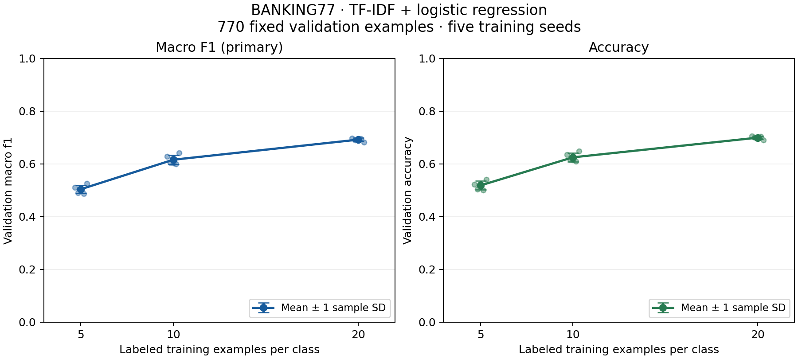
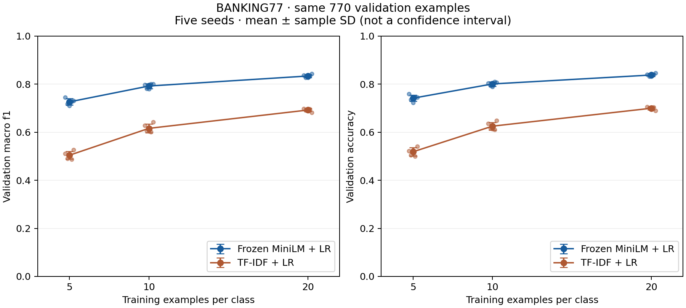

# Verified reproducible results

## EXP-002 — validation learning curve (2026-09-24)

EXP-002 uses the unchanged word unigram/bigram TF-IDF + L2 multinomial logistic-regression pipeline at clean Git commit `30645360724d7fb8fe0c5a11d7dd7e02f3ac339b`. Dataset: BANKING77 revision `57ec275d8078af65b7731c2a98be812d844a6d6b`. Split protocol: `banking77-val10-v2`, seed 20260924, all 77 classes, the same 770 validation examples. Training seeds: 11, 22, 33, 44, 55; N=5/10/20. No model settings, splits, or seeds were selected using these scores.

| Shots/class | Train/run | Accuracy mean ± SD (%) | Macro-F1 mean ± SD (%) | Macro-F1 min–max (%) |
| --- | ---: | ---: | ---: | ---: |
| 5 | 385 | 51.84 ± 1.69 | 50.41 ± 1.58 | 48.77–52.59 |
| 10 | 770 | 62.49 ± 1.60 | 61.58 ± 1.81 | 60.05–64.14 |
| 20 | 1,540 | 69.95 ± 0.61 | 69.19 ± 0.63 | 68.18–69.80 |

Accuracy and F1 are shown as percentages. SD is sample standard deviation across five training seeds (`ddof=1`). Minimum/maximum F1 includes all five seeds. Exact values and per-seed records: [study evidence](../experiments/exp002-learning-curve/README.md), [summary JSON](../experiments/exp002-learning-curve/summary.json), [per-run CSV](../experiments/exp002-learning-curve/per_run.csv).

Both increments improved accuracy and macro-F1 for every paired seed. Mean macro-F1 gains were **+11.17 percentage points** from 5→10 (seed gains 9.81–11.71) and **+7.61 points** from 10→20 (4.04–9.50). Accuracy gains were +10.65 and +7.45 points. These are substantial, consistent development-set gains; no formal population significance claim is made.

Macro-F1 seed SD is **1.58 → 1.81 → 0.63 percentage points**: variance does not decrease monotonically, but is much lower at 20 shots. Accuracy SD is **1.69 → 1.60 → 0.61 points**. Seed variability is not validation-sampling uncertainty.

The slope is flattening, but the curve does **not yet show a clear plateau**: 10→20 still adds 7.61 macro-F1 points on average. Diminishing returns are especially visible per added example/class (approximately 2.23 F1 points for 5→10 versus 0.76 for 10→20). Three budgets cannot establish an asymptote.

## Reproducibility and scope

All 15 primary runs and 15 independent local refits completed without warnings or failures. Refits used separate clean output directories, reproduced sampled IDs, predicted labels, and complete quality metrics exactly, and had zero maximum absolute difference in classifier coefficients/intercepts. Only the 15 primary runs enter the aggregates. This is local reproducibility, not independent external or cross-platform replication.

The verifier checked every required artifact and recorded hash, dataset/split/configuration agreement, exact N-per-class training membership, train/validation/test ID and normalized-text isolation, and shared validation order/labels. Each saved TF-IDF vocabulary and IDF vector exactly matched a vectorizer rebuilt using only its intended training texts. Saved models reproduced their validation predictions/probabilities. Metrics were recomputed from all saved predictions. The aggregate summary, error-analysis JSON, and per-run CSV were independently regenerated byte-for-byte from the versioned records. No official test rows were parsed during this study; test access was limited to pinned byte-integrity checks. No test evaluation occurred.

The complete suite passed **35 tests**, including checks that aggregation rejects missing/duplicate seeds, changed validation IDs/configurations, fabricated metrics, and ID leakage, and uses sample rather than population SD. Verification details: [verification JSON](../experiments/exp002-learning-curve/verification.json). Plot axes, seed points, and error bars were visually inspected.

Across all primary runs, 5,394 unique training rows and 770 validation rows were used (6,164 distinct fitting/validation labels). Per-run budgets are documented in the plan; all source-training labels accessed for auditing/stratification are disclosed separately. The official test file remains unchanged and unevaluated.

## Measured intent weaknesses and confusions

Across all regimes and seeds (equal weight per model), the lowest mean recalls were:

| Intent | Mean validation recall across all 15 primary models (%) |
| --- | ---: |
| `topping_up_by_card` | 26.00 |
| `supported_cards_and_currencies` | 26.00 |
| `transfer_fee_charged` | 26.00 |
| `card_delivery_estimate` | 28.00 |
| `unable_to_verify_identity` | 28.67 |

At 20 shots, the lowest recalls and all highest-recall ties were:

| 20-shot intent | Mean recall (%) | Mean F1 (%) |
| --- | ---: | ---: |
| `transfer_fee_charged` | 30.00 | 39.36 |
| `unable_to_verify_identity` | 32.00 | 34.17 |
| `supported_cards_and_currencies` | 32.00 | 39.50 |
| `wrong_exchange_rate_for_cash_withdrawal` | 36.00 | 48.74 |
| `topping_up_by_card` | 38.00 | 42.63 |
| `verify_source_of_funds` | 100.00 | 92.64 |
| `apple_pay_or_google_pay` | 100.00 | 99.05 |
| `lost_or_stolen_phone` | 100.00 | 99.05 |

| True intent → predicted intent (20-shot) | Errors across five seeds | Distinct validation requests involved |
| --- | ---: | ---: |
| `get_disposable_virtual_card` → `disposable_card_limits` | 19/50 | 4/10 |
| `getting_virtual_card` → `virtual_card_not_working` | 17/50 | 6/10 |
| `unable_to_verify_identity` → `why_verify_identity` | 16/50 | 7/10 |
| `topping_up_by_card` → `top_up_by_cash_or_cheque` | 15/50 | 5/10 |
| `wrong_exchange_rate_for_cash_withdrawal` → `card_payment_wrong_exchange_rate` | 15/50 | 4/10 |

Full class metrics/confusion matrices are in [error analysis](../experiments/exp002-learning-curve/error_analysis.json). These counts reflect repeated predictions on the same fixed requests; they do not multiply the validation sample size.

## Limitations

These are validation results on only 10 fixed examples per class, reused across training seeds and regimes. SD uses `ddof=1` across the five training seeds; it is neither a confidence interval nor an estimate of uncertainty over new traffic. The legacy validation=20 smoke is excluded. Class-level 100% recall is an observation on a tiny holdout, not a reliability guarantee. Confusion counts repeat the same requests across models; 50 prediction events per class/regime represent only 10 distinct validation requests. Training subsets overlap across seeds, and validation was available in earlier development, so these are development comparisons rather than a fresh confirmatory evaluation. Near-duplicate leakage beyond the implemented normalized-exact audit remains untested. No production-quality, routing, calibration, or cost-savings claim is supported.

## EXP-004 — frozen MiniLM versus TF-IDF validation curve (2026-09-25)

**Completed and independently reproduced locally.** Same 5/10/20-shot budgets, seeds 11/22/33/44/55 and exact EXP-002 v2 train/validation IDs. Model revision/settings and LR hyperparameters are unchanged from EXP-003; the encoder stayed frozen. No tuning or official-test evaluation.

Values below are mean ± sample SD across five primary training seeds. Refit runs are excluded from these aggregates.

| Shots/class | MiniLM accuracy (%) | MiniLM macro-F1 (%) | TF-IDF accuracy (%) | TF-IDF macro-F1 (%) |
| --- | ---: | ---: | ---: | ---: |
| 5 | 74.13 ± 1.30 | 72.60 ± 1.34 | 51.84 ± 1.69 | 50.41 ± 1.58 |
| 10 | 80.05 ± 0.93 | 79.19 ± 1.03 | 62.49 ± 1.60 | 61.58 ± 1.81 |
| 20 | 83.77 ± 0.66 | 83.35 ± 0.68 | 69.95 ± 0.61 | 69.19 ± 0.63 |

Macro-F1 improvements against each matching TF-IDF run (percentage points):

| Shots/class | Seed 11 | Seed 22 | Seed 33 | Seed 44 | Seed 55 | Mean gain |
| --- | ---: | ---: | ---: | ---: | ---: | ---: |
| 5 | +23.33 | +22.74 | +20.39 | +24.01 | +20.49 | +22.19 |
| 10 | +16.87 | +17.64 | +17.62 | +20.01 | +15.87 | +17.60 |
| 20 | +13.86 | +13.59 | +13.36 | +13.86 | +16.11 | +14.16 |

MiniLM improves macro-F1 for **all 15 matched training-budget/seed pairs**. Mean advantages over TF-IDF are +22.19, +17.60, and +14.16 percentage points at 5/10/20 shots. Absolute differences for every seed are retained above; no best seed was selected.

The MiniLM curve gains **6.58 macro-F1 points from 5→10** and **4.16 points from 10→20**. Returns diminish, but these three budgets do not establish a plateau. MiniLM macro-F1 seed SD decreases **1.34 → 1.03 → 0.68 points**, and accuracy SD decreases **1.30 → 0.93 → 0.66 points**. MiniLM's seed SD is lower than TF-IDF's at 5/10 shots but slightly higher at 20 shots. Macro-F1 ranges across all five seeds: 5-shot 70.94–74.46%; 10-shot 77.99–80.06%; 20-shot 82.65–84.29%.

All 15 primary runs and all 15 independent local refits completed without warnings or failures. The reproduction stage reloaded the pinned frozen encoder and recomputed all 6,164 required vectors into a separate cache, then fitted new logistic-regression instances for every configuration. Embedding maximum absolute difference was **0.0** (predeclared tolerance 1e-6, relative tolerance zero). Every pair had identical sampled IDs, predicted labels, full metrics, and classifier coefficients/intercepts; maximum parameter difference was **0.0** for all 15. The 5-shot seed-11 run also reproduced EXP-003's predictions and metrics exactly. Only primary runs enter aggregates.

This is independent local re-encoding and refitting using the same implementation and machine, not independent external replication or uncertainty over new traffic. Saved classifier replay is an additional integrity check, not counted as another independent fit. Artifact/cache/source hashes, reference sample hashes, exact per-class training counts, fixed validation IDs/labels, normalized-text/ID isolation, feature alignment, unchanged encoder state, and classifier probability/prediction replay all passed. A separate NumPy calculation agreed with all reported means and sample SDs to maximum absolute difference 1.11e-16. Summary JSON, per-seed CSV and plot were regenerated byte-for-byte from compact primary records. **64 tests passed**; the figure was visually inspected.

Every run uses **770 additional validation labels** (10 per class), besides 385/770/1,540 training labels for 5/10/20 shots. Per-run totals are 1,155/1,540/2,310. Across the study, 5,394 unique training rows plus 770 validation rows give 6,164 unique task labels. These are the same examples used by EXP-002; the new representation and refits added no new unique task labels. All 10,003 official-training labels were mechanically read for audit/stratification and are separately disclosed. The encoder benefits from substantial external pretraining; this is simulated few-shot task adaptation, not total training-data or annotation-cost accounting.

The official BANKING77 test set stayed sealed. Test access was limited to byte-integrity checks; no test rows were parsed, labeled, inspected, encoded, tuned on, or evaluated. Existing stored test IDs/text hashes were used for isolation checks. The dataset and split manifest are unchanged.

SD is **sample SD across five training seeds (`ddof=1`)**, not a confidence interval or uncertainty over new validation samples. All runs share the same previously used 770-case holdout, with only ten examples per class; seeds share overlapping training data. These are paired development comparisons, not confirmatory unseen-test or production results. Public-benchmark exposure in upstream pretraining and semantic near-duplicate leakage cannot be ruled out. No calibration, routing, production-quality, or cost-savings claim is established.

Classifier timings use cached embeddings and **are not end-to-end inference measurements**. Encoding/cache construction is recorded separately; end-to-end speed and costs are unmeasured.

Reproducible evidence: [study README](../experiments/exp004-minilm-learning-curve/README.md), [summary JSON](../experiments/exp004-minilm-learning-curve/summary.json), [all seed values and paired improvements](../experiments/exp004-minilm-learning-curve/per_seed.csv), [independent refit checks](../experiments/exp004-minilm-learning-curve/verification.json), and [artifact/aggregate audit](../experiments/exp004-minilm-learning-curve/analysis_audit.json).

## EXP-006R — preparation status only (2026-09-26)

**Paid recovery NOT RUN; no recovered research results are available.** A separate, tested recovery protocol is prepared for exactly the original EXP-006's 52 unresolved HTTP-429 IDs. All original EXP-006 files are preserved. Preparation used synthetic responses and a zero-inference dry run only; preparation API spend is $0. The quota/credit issue must be resolved and a new explicit recovery approval/cap obtained before live execution.

No recovered accuracy, macro-F1, combined quality, actual recovery charge or production saving is claimed. The original 770 validation IDs and additional validation-label budget remain unchanged, and the official test remains sealed. Any later merged result must be labeled **EXP-006 + EXP-006R recovery** and retain failures. [Preparation protocol and verification](../experiments/exp006r-429-recovery-preparation/README.md).
