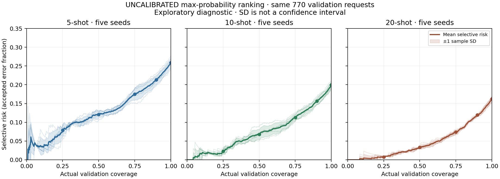

# EXP-005 — confidence and selective-prediction diagnostic

**Completed exploratory analysis, 2026-09-25.** On this reused validation set, higher uncalibrated confidence identifies subsets with higher average accuracy for all three training budgets. This does not establish calibration or a production threshold. Some intents disappear entirely from the accepted subset.

No new model was trained or executed. All 15 EXP-004 primary runs are retained: 5/10/20 shots × seeds 11/22/33/44/55. EXP-004 reproductions and the obsolete smoke run are excluded. The official test remained sealed; this analysis did not read raw dataset files or test bytes.

## Observed coverage/error tradeoffs

Mean ± **sample SD across five training seeds** (`ddof=1`), not confidence intervals. Each seed uses the **same 770 validation requests**, so these are not five independent datasets. Accepted counts and actual coverage are fixed across seeds (SD zero). Error-count means may be fractional; individual error counts are integers in the saved records. The last column gives mean ± SD followed by minimum–maximum across seeds.

| Shots/class | Actual coverage (%) | Accepted/run | Accepted accuracy (%) | Selective risk (%) | Errors/run | Intents with zero accepted |
| --- | ---: | ---: | ---: | ---: | ---: | ---: |
| 5 | 25.065 | 193 | 92.12 ± 1.44 | 7.88 ± 1.44 | 15.20 ± 2.77 | 31.60 ± 2.30 (28–34) |
| 5 | 50.000 | 385 | 87.90 ± 0.91 | 12.10 ± 0.91 | 46.60 ± 3.51 | 8.20 ± 2.39 (5–11) |
| 5 | 75.065 | 578 | 82.49 ± 1.65 | 17.51 ± 1.65 | 101.20 ± 9.55 | 0.80 ± 0.84 (0–2) |
| 5 | 90.000 | 693 | 78.67 ± 1.25 | 21.33 ± 1.25 | 147.80 ± 8.64 | 0.00 ± 0.00 (0–0) |
| 5 | 100.000 | 770 | 74.13 ± 1.30 | 25.87 ± 1.30 | 199.20 ± 10.03 | 0.00 ± 0.00 (0–0) |
| 10 | 25.065 | 193 | 97.72 ± 0.70 | 2.28 ± 0.70 | 4.40 ± 1.34 | 29.80 ± 2.05 (28–32) |
| 10 | 50.000 | 385 | 93.25 ± 1.31 | 6.75 ± 1.31 | 26.00 ± 5.05 | 8.00 ± 1.58 (6–10) |
| 10 | 75.065 | 578 | 88.72 ± 1.00 | 11.28 ± 1.00 | 65.20 ± 5.76 | 0.80 ± 1.30 (0–3) |
| 10 | 90.000 | 693 | 84.36 ± 0.88 | 15.64 ± 0.88 | 108.40 ± 6.11 | 0.00 ± 0.00 (0–0) |
| 10 | 100.000 | 770 | 80.05 ± 0.93 | 19.95 ± 0.93 | 153.60 ± 7.13 | 0.00 ± 0.00 (0–0) |
| 20 | 25.065 | 193 | 99.27 ± 0.28 | 0.73 ± 0.28 | 1.40 ± 0.55 | 27.00 ± 1.58 (25–29) |
| 20 | 50.000 | 385 | 96.68 ± 0.34 | 3.32 ± 0.34 | 12.80 ± 1.30 | 6.00 ± 1.22 (5–8) |
| 20 | 75.065 | 578 | 92.60 ± 0.55 | 7.40 ± 0.55 | 42.80 ± 3.19 | 0.00 ± 0.00 (0–0) |
| 20 | 90.000 | 693 | 88.05 ± 0.30 | 11.95 ± 0.30 | 82.80 ± 2.05 | 0.00 ± 0.00 (0–0) |
| 20 | 100.000 | 770 | 83.77 ± 0.66 | 16.23 ± 0.66 | 125.00 ± 5.10 | 0.00 ± 0.00 (0–0) |

At every reported landmark below full coverage, each of the 15 individual runs is more accurate than its own full-coverage result. The complete prefix curves need not be monotonic: accepting one more request can increase or decrease risk. The small extreme-confidence tail is particularly noisy.



At 20 shots, accepting 193/770 requests gives 1–2 errors per seed; accepting 385 gives 12–15 errors; accepting 578 gives 39–47 errors; accepting 693 gives 81–85 errors; all 770 gives 118–130 errors. These are observed ranked prefixes, not recommended probability cutoffs or prospective service guarantees.

## Intent coverage and limitations

At approximately 25% coverage, each 20-shot run rejects every validation example from **25–29 of 77 intents**. At 50%, it still omits **5–8 intents**. `cash_withdrawal_not_recognised` has zero accepted examples at 50% in all 15 runs; `topping_up_by_card` also has zero in all five 20-shot runs. At approximately 75%, every intent appears in every 20-shot accepted subset, while some 5/10-shot runs still omit up to 2/3 intents. Higher overall accepted accuracy therefore includes a changing intent mix; it does not demonstrate uniform improvement for every intent.

[Per-class CSV](per_class_acceptance.csv) contains all 5,775 run/landmark/intent rows, including support (10), accepted, rejected and accepted-error counts. [Summary JSON](summary.json) includes per-class acceptance means, sample SDs, ranges, all seed values, and zero-acceptance seed counts. No intents or seeds were suppressed.

The **770 additional validation labels** (10/class) were already used for earlier model comparisons. EXP-005 adds zero new labels, fitting, encoder executions or calibrators. Five training seeds measure sensitivity to training samples, not uncertainty on new validation data or traffic. Repeated exploratory use of the holdout limits confirmatory claims, and ten cases per intent cannot establish rare-error reliability. The external pretrained representation and original label-budget limitations remain those of EXP-004.

Confidence here is **UNCALIBRATED**: maximum logistic-regression class probability, not a verified probability of correctness. No calibrator or production threshold was fitted or selected. Rejected requests have no assumed outcome. There is no combined-system accuracy, latency, dollar-savings or production-quality claim.

## Fixed ranking protocol

The pre-execution protocol is retained in [protocol.md](protocol.md).

1. Verify saved probability, prediction, label and ID alignment/provenance before using scores. Do not refit or regenerate intact artifacts.
2. Rank by descending exact maximum class probability. Break exact ties by ascending SHA-256 of the UTF-8 sample ID, then sample ID. Ranking does not receive true labels or correctness. Do not round confidence. The actual 15 runs have no exact confidence ties.
3. Evaluate every prefix `k = 0..770`. At requested coverages 25/50/75/90/100%, take `ceil(target * 770)`: 193/385/578/693/770. Actual coverage is `k / 770`. A tie can be split by the predefined ID rule; this is a ranked-prefix diagnostic rather than a fixed score-threshold policy.
4. Accepted accuracy is `(k - errors) / k`; selective risk is `errors / k`. At `k=0`, both are undefined (`null`), not zero. Every run's `k=770` accuracy must exactly equal its EXP-004 score.
5. Use true labels after selection only to calculate errors and per-class acceptance counts. Aggregate all five seeds equally within each budget using sample SD.

## Provenance and verification

The input study is `experiments/exp004-minilm-learning-curve/`, with original full artifacts in the ignored `artifacts/exp004-minilm-learning-curve/`. Each compact diagnostic retains its original EXP-004 run ID, shots/seed, dataset/encoder revisions, split/sample hashes, full-coverage score, ordered IDs, truth/predictions, exact confidence scores and landmarks. No raw request text is copied into this evidence.

The input audit matched versioned EXP-004 record hashes, local metadata/predictions/metrics/sample lists, archived EXP-002 reference sample IDs, original source snapshots and all recorded artifact hashes. Classifier and feature files were hashed, never loaded for model execution. Probability matrices were checked for row/class order, dimensions, finite values, range, normalization, and agreement between maximum probability and predicted class. All complete EXP-004 metrics were recomputed from predictions. Cache hashes, model revision/settings and recorded frozen-state provenance matched. All runs share the identical 770 IDs and true labels. **No probability regeneration was needed.**

A separate [standard-library checker](independent_check.py), without imports from the baseline implementation, independently audited the original inputs and reproduced all confidence rankings, every prefix's error counts, landmarks and per-class counts. Aggregate means/sample SDs also matched an independent calculation to maximum absolute difference **1.78e-15**. The compact records regenerated all 15 run files, summary JSON, both CSV tables, complete aggregate curves and the PNG **byte-for-byte**. Verification evidence is in [verification.json](verification.json). The plot was visually inspected.

The completed analysis is recorded in [metadata.json](metadata.json): started `2026-09-25T18:47:05.905393+00:00`, finished `2026-09-25T18:47:08.388105+00:00`. Source base commit is `e1b428c606567b19145ef058e0f96f77f75fb060` plus the recorded analysis/test/protocol snapshot. Post-run documentation updates follow that snapshot; analysis code and tests are unchanged. The historical paths/dirty patch in metadata are provenance, not another runtime requirement. Full source snapshots remain in the ignored local artifact directory. The milestone commit contains the implementation, tests and independent checker. Original model code, package pins, dataset/splits and EXP-001–004 evidence remain unchanged.

Test suite: **99 passed**. New synthetic tests cover label-blind order/ties, exact counts, ceil coverage, zero-acceptance nulls, risk/accuracy arithmetic, per-class omissions, full-coverage equality, all-seed aggregation/sample SD, row/class/label alignment, invalid probabilities, changed validation IDs/truth and compact-record corruption. Tests do not add a BANKING77 experiment. No diagnostic execution or provenance check failed; no run was discarded.

## Reproduction

From the repository root, using the existing locked environment and a fresh output directory, regenerate every curve/table/plot without downloading data, executing an encoder or loading a classifier:

```sh
MPLCONFIGDIR=.cache/matplotlib .venv/bin/python -m baseline.selective --records-dir experiments/exp005-selective-diagnostic/runs --output artifacts/exp005-recomputed-new
```

The committed compact records omit the full prefix table because it is reconstructed exactly from ordered scores/labels. Regeneration writes `full_curves.json` locally. Original probability matrices, caches, classifiers, large independent report and source snapshots remain ignored; their hashes are recorded.

The original analysis command, requiring the intact local EXP-004 full artifacts, was:

```sh
MPLCONFIGDIR=.cache/matplotlib .venv/bin/python -m baseline.selective --artifacts artifacts/exp004-minilm-learning-curve --output artifacts/exp005-selective-diagnostic
```

The independent input audit/calculation also requires those existing artifacts; it never refits or encodes:

```sh
.venv/bin/python experiments/exp005-selective-diagnostic/independent_check.py --output artifacts/exp005-independent-new.json
.venv/bin/python -m pytest -q
```

Use unused output paths; the commands refuse overwriting prior output. Verification-only repetition does not create another independent validation sample.
